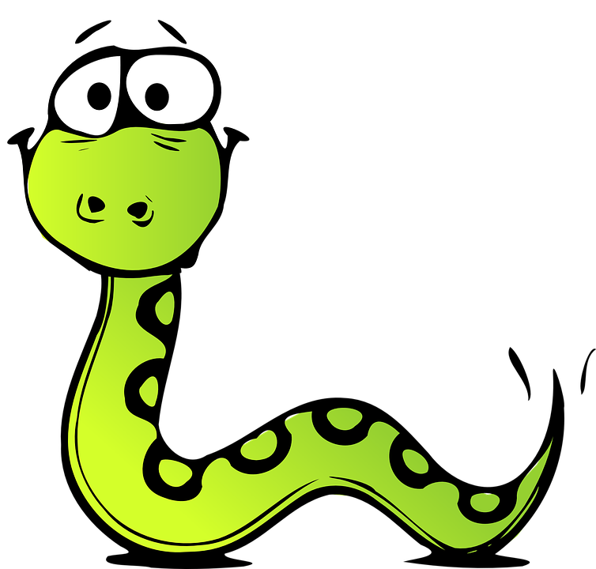

# PoobStairs

## ¿De qué trata el proyecto?

PoobStairs es una implementación en Java del clásico juego de mesa "Escaleras y Serpientes" (Snakes and Ladders), con una interfaz gráfica desarrollada en Swing. Permite jugar en modo jugador vs jugador o jugador vs máquina, e incluye casillas especiales y modificadores para hacer el juego más dinámico.

## ¿Qué se requiere instalar?

- **Java JDK 8 o superior**
- **IntelliJ IDEA** (opcional, pero recomendado para desarrollo)
- **Git** (opcional, para clonar el repositorio)

## ¿Cómo se ejecuta el proyecto en local?

1. Clona el repositorio o descarga el código fuente.
2. Abre el proyecto en IntelliJ IDEA o tu IDE favorito.
3. Asegúrate de tener configurado el JDK.
4. Ejecuta la clase `src/presentation/PoobStairsGUI.java` como aplicación Java.
5. La interfaz gráfica se abrirá y podrás comenzar a jugar.

## ¿Qué arquitectura tiene?

El proyecto sigue una arquitectura **MVC (Modelo-Vista-Controlador)**:
- **Modelo:** Lógica del juego y entidades (`domain/`)
- **Vista:** Interfaz gráfica (`presentation/PoobStairsGUI.java`)
- **Controlador:** Gestión de eventos y comunicación entre modelo y vista

## ¿Qué estructura tiene el proyecto?

```
src/ ├── domain/ # Lógica del juego y entidades (cajas, jugadores, etc.) 
     └── presentation/ # Interfaz gráfica (PoobStairsGUI.java) 
bin/ # Archivos compilados 
img/ # Imágenes usadas en la GUI
```
## Pruebas

Las pruebas pueden implementarse usando JUnit en la carpeta `test/`. Actualmente, la mayoría de la lógica se puede probar creando instancias de las clases del paquete `domain`.

## ¿Cómo se puede dockerizar?

1. Crea un archivo `Dockerfile` con el siguiente contenido:

    ```dockerfile
    FROM openjdk:17-jdk
    COPY ./bin /app/bin
    COPY ./img /app/img
    WORKDIR /app
    CMD ["java", "-cp", "bin", "presentation.PoobStairsGUI"]
    ```

2. Construye la imagen:

    ```
    docker build -t poobstairs .
    ```

3. Ejecuta el contenedor:

    ```
    docker run -e DISPLAY=$DISPLAY -v /tmp/.X11-unix:/tmp/.X11-unix poobstairs
    ```

> **Nota:** Para ejecutar aplicaciones gráficas en Docker, es necesario compartir el servidor X del host.

## ¿Cómo se puede desplegar?

- **Local:** Ejecutando la aplicación Java directamente.
- **Remoto:** Puede desplegarse en una máquina virtual con entorno gráfico o usando Docker con soporte para GUI.
- **Web:** No está preparado para despliegue web, ya que es una aplicación de escritorio.

## Resultados de cómo se ve




## Autor

- 
- Julian Camacho